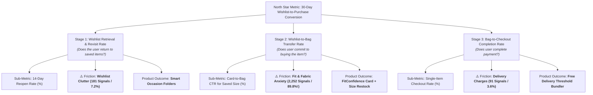

# Part 2: Business Metric Decomposition

## Objective
Break down the North Star Metric:
$$\text{30-Day Wishlist-to-Purchase Conversion Rate}$$
into its mathematical components, product outcomes, and behavioral levers to identify where the highest-potential conversion opportunity lies.

---

## 1. Visual Metric Decomposition Chart (Slide 2 Graphic)

> **Web View:** You can also open the visual graphic directly in your browser: [metric-decomposition.svg](file:///c:/Users/DELL/Downloads/gradp2-main/gradp2-main/metric-decomposition.svg) or on localhost: [http://localhost:3000/metric-decomposition.svg](http://localhost:3000/metric-decomposition.svg).

---

## 2. Top-Level Metric Definition

$$\text{30-Day Wishlist Conversion Rate} = \frac{\text{Unique Users who purchase } \ge 1 \text{ wishlisted item within 30 days of adding it}}{\text{Total Unique Users who added } \ge 1 \text{ item to their wishlist in that 30-day window}}$$

* **Business Value:** Directly increases purchase frequency and customer lifetime value (LTV) from high-intent demand already on the platform.
* **Core Constraint:** **Zero monetary incentives** (no discounts, coupons, price cuts, or cashback). Must be 100% product-led.

---

## 3. The 3-Stage Mathematical Funnel

The metric decomposes into a multiplicative probability chain across 3 behavioral stages:

$$\text{30-Day Conversion} = P(\text{Stage 1: Revisit}) \times P(\text{Stage 2: Wishlist} \to \text{Bag} \mid \text{Revisit}) \times P(\text{Stage 3: Checkout} \mid \text{Bag})$$

---

## 4. Deep-Dive into the 3 Stages

### Stage 1: Retrieval & Revisit (Discovery & Clutter Domain)
* **User Psychology:** Shoppers bulk-save items while browsing during sales or commute scrolling. The wishlist grows to 50–200 items. High-intent items get pushed to the bottom and forgotten.
* **Primary Sub-Metric:** `14-Day Wishlist Reopen Rate (%)` and `Deep-Scroll Rate (% scrolling beyond top 10 items)`.
* **Friction in Review Analyzer:** **181 Signals (7.2%)** under *Wishlist Clutter & Organization*.
* **Customer Voice:**
  > *"I have like 200 items saved in my wishlist and it is just a giant cluttered feed. I wish there was a way to create folders like 'Workwear' or 'Lehenga options' so I don't forget what I added."* — *Reddit r/myntra*
* **Target Product Outcome:** Transform the flat list into **Smart Occasion Folders** (*"Workwear"*, *"Festive"*, *"Vacation"*), reducing retrieval time from 45 seconds to $< 5$ seconds.

---

### Stage 2: Wishlist $\to$ Bag Transfer (The Primary Bottleneck ⭐)
* **User Psychology:** The user opens their wishlist, looks at an item they liked 5 days ago, but hesitates to move it to the bag because sizing charts are flat and fabric quality is uncertain.
* **Primary Sub-Metric:** `Wishlist Card-to-Bag CTR for Saved Size (%)`.
* **Friction in Review Analyzer:** **2,252 Signals (89.8% of all friction!)** under *Fit & Fabric Anxiety* + 17 Size Stockout signals.
* **Customer Voice:**
  > *"I love the dress in my wishlist, but I don't know if UK 8 will fit me or UK 10, and I hate the hassle of returns."* — *Play Store Review*
* **Target Product Outcome:** **FitConfidence Overlay & Real-Buyer Photo Reels** directly on the wishlist card. Provide instant true-to-size curves and buyer photos to remove fit doubt before the bag step.

---

### Stage 3: Bag $\to$ Order Checkout (Delivery Friction Domain)
* **User Psychology:** User moves a ₹599 wishlisted top to the bag, but abandons at checkout when hit by an added ₹99 delivery charge for orders below ₹1,199.
* **Primary Sub-Metric:** `Single-Item Wishlist Checkout Completion Rate (%)`.
* **Friction in Review Analyzer:** **91 Signals (3.6%)** under *Delivery & Shipping Friction*.
* **Customer Voice:**
  > *"Every time I try to checkout a single top from my wishlist Myntra adds a 99 rupees shipping fee. That is almost 20% of the price! Wish they had free shipping thresholds combined across wishlisted items."* — *Shopping Communities*
* **Target Product Outcome:** **Free Delivery Cart Bundler** prompting wishlisted items as 1-click add-ons to cross minimum delivery thresholds naturally.

---

## 5. Opportunity Sizing & Leverage Analysis

Where does the highest multiplication leverage lie?

| Stage | Signals in Review Analyzer | % of Total Friction | Conversion Leverage |
|---|---|---|---|
| **Stage 1: Revisit / Clutter** | 181 signals | 7.2% | **Moderate:** Brings users back, but if fit doubts remain, they still do not convert. |
| **Stage 2: Fit & Fabric Confidence** | **2,252 signals** | **89.8%** | **HIGHEST (The Core Lever):** Resolves the dominant reason shoppers hesitate to commit to their saved items. |
| **Stage 3: Delivery Fee Bundling** | 91 signals | 3.6% | **High (Secondary):** Unlocks checkout for single-item cart abandoners. |

---

## 6. Slide 2 Synthesis for the 10-Slide Deck

* **Slide Title:** **Wishlist-to-Purchase Conversion Fails at the Confidence Step, Not Retrieval**
* **Key Message:**
  > *While clutter causes forgetfulness (7.2%) and delivery charges cause cart drop-offs (3.6%), **89.8% of all purchase hesitation** is trapped in Stage 2 (Fit & Fabric Anxiety). Therefore, our primary product intervention must focus on pre-purchase fit confidence directly on the wishlist card.*
